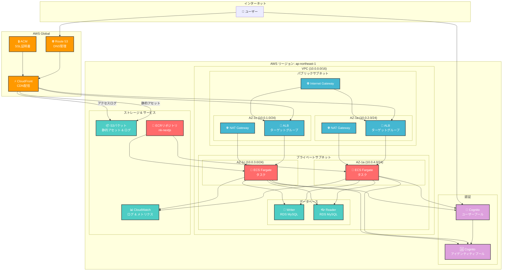
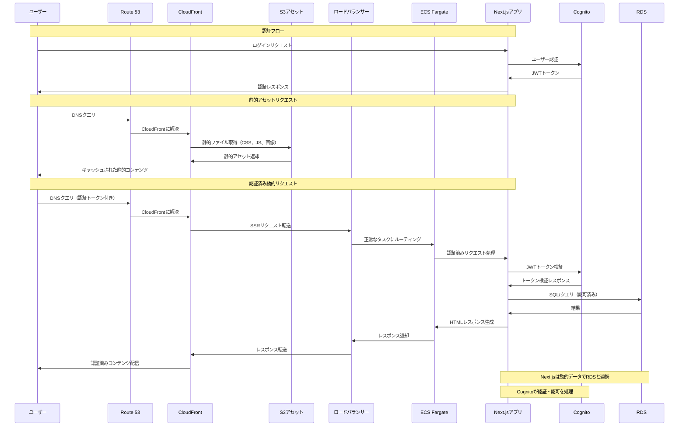
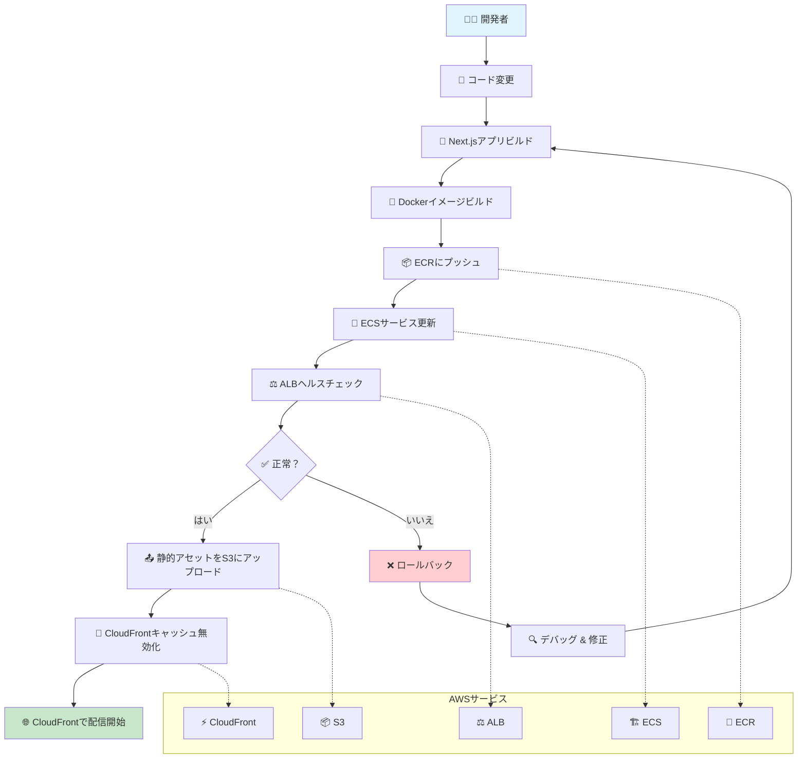

# Next.js SSR AWS インフラストラクチャ

このTerraformの設定は、以下のAWSサービスを使用してプロダクション対応のNext.js SSRアプリケーションをデプロイします：

- **VPC** - パブリックおよびプライベートサブネットを含むカスタム仮想プライベートクラウド
- **ALB** - ロードバランシング用のアプリケーションロードバランサー
- **ECS** - コンテナ実行用のElastic Container Service（Fargate使用）
- **ECR** - Dockerイメージ用のElastic Container Registry
- **CloudFront** - グローバルコンテンツ配信用のCDN
- **S3** - 静的アセットとCloudFrontログ用の単一バケット
- **RDS MySQL** - アプリケーションデータ用のServerless v2リレーショナルデータベース
- **Cognito** - ユーザー認証・認可
- **Route 53** - DNS管理（オプション）
- **ACM** - SSL証明書（オプション）

## アーキテクチャ



### データフロー



## 前提条件

1. **AWS CLI** - 適切な認証情報で設定済み
2. **Terraform** - インストール済み（v1.10+）
3. **Docker** - コンテナイメージビルド用
4. **Next.jsアプリケーション** - デプロイ準備完了

## クイックスタート

### 1. S3バックエンドの設定（初回セットアップ）

メインインフラストラクチャをデプロイする前に、S3バケットを手動で作成する必要があります（例：s3://s3.nk-dev.art-club.net）

### 2. Terraformの初期化（以降の実行）

```bash
terraform init -backend-config=backend.hcl
```

### 3. インフラストラクチャの計画

```bash
terraform plan
```

### 4. インフラストラクチャのデプロイ

```bash
terraform apply
```

### 5. アプリケーションのデプロイ

インフラストラクチャのデプロイが完了したら、デプロイ手順を確認します：

```bash
terraform output deployment_instructions
```

現在のデプロイプロセスには以下が含まれます：

#### Dockerイメージのビルドとプッシュ

```bash
# Next.jsアプリをビルド
npm run build

# ECRにログイン（リポジトリは自動作成されます）
aws ecr get-login-password --region ap-northeast-1 | docker login --username AWS --password-stdin [ECR_URL]

# Dockerイメージをビルド
docker build -t nk-nextjs .

# ECR用にタグ付け
docker tag nk-nextjs:latest [ECR_URL]:latest

# イメージをプッシュ
docker push [ECR_URL]:latest
```

#### ECSサービスの更新

```bash
# 更新されたイメージで新しいデプロイを強制
aws ecs update-service --cluster nk-dev-cluster --service nk-dev-service --force-new-deployment

# デプロイを監視
aws ecs describe-services --cluster nk-dev-cluster --services nk-dev-service
```

#### 静的アセットのS3アップロード

```bash
# Next.js静的アセットをアップロード
aws s3 sync ./out/_next s3://[BUCKET_NAME]/_next --delete

# パブリックアセットをアップロード
aws s3 sync ./public s3://[BUCKET_NAME]/static --delete
```

#### アプリケーションへのアクセス

- **CloudFront（CDN）**: `https://[CLOUDFRONT_DOMAIN]`

> **注意**: すべての具体的なURLとコマンドは`terraform output deployment_instructions`で提供されます

## 設定

### 変数

`terraform.tfvars`でカスタマイズできる主要変数：

- `project_name` - プロジェクト名
- `environment` - 環境（prod、staging、dev）
- `aws_region` - AWSリージョン
- `domain_name` - カスタムドメイン
- `container_port` - アプリが実行されるポート
- `desired_capacity` - ECSタスク数

#### データベース変数

- `db_engine_version` - RDS MySQLエンジンバージョン（例：`5.7.mysql_aurora.2.11.1`）
- `db_master_username` - マスターDBユーザー名 _（本番環境ではAWS Secrets Managerにシークレットを配置）_
- `db_master_password` - マスターDBパスワード **機密情報！本番環境ではAWS Secrets Managerを使用**

例（`terraform.tfvars`）：

```hcl
# RDS MySQL設定
db_engine_version = "5.7.mysql_aurora.2.11.1"
db_master_username = "admin"
db_master_password = "ChangeMe123!" # 本番環境ではSecrets Managerを使用
```

**シークレットのベストプラクティス：**

- パスワード、ユーザー名、または機密DB情報は[AWS Secrets Manager](https://docs.aws.amazon.com/secretsmanager/latest/userguide/intro.html)に保存してください。
- Terraformでは`aws_secretsmanager_secret`と`aws_secretsmanager_secret_version`リソースを使用してシークレットを参照してください。
- 実際のシークレットをGitリポジトリや`terraform.tfvars`にコミットすることは避けてください。

### カスタムドメインの設定

カスタムドメインを使用するには：

1. `terraform.tfvars`で`domain_name`を更新
2. `route53.tf`でRoute 53とACMリソースのコメントアウトを解除
3. `cloudfront.tf`でCloudFrontエイリアスのコメントアウトを解除
4. `terraform apply`を実行

## Cognito認証

インフラストラクチャにはユーザー認証用のAWS Cognitoが含まれています：

### 機能

- **メールベース認証** - 検証が必要
- **高度セキュリティモード** - 有効
- **パスワードポリシー** - 8文字以上、大文字、小文字、数字
- **OAuth2フロー** - 認可コードフロー
- **トークン有効期限** - 1時間（アクセス/IDトークン）、30日（リフレッシュトークン）
- **HTTPS コールバックURL** - 本番環境用に設定
- **localhost サポート** - 開発環境用

### 統合

Cognito設定を取得：

```bash
terraform output cognito_user_pool_id
terraform output cognito_user_pool_client_id
terraform output cognito_domain
```

**Next.js統合例：**

- NextAuth.jsとCognitoプロバイダー
- AWS Amplify UIコンポーネント
- 直接AWS SDK統合

## ファイル構造

```
├── main.tf              # メイン設定とプロバイダー
├── backend.hcl          # S3バックエンド設定
├── variables.tf         # 入力変数
├── terraform.tfvars     # 変数値（gitに含まれない）
├── vpc.tf              # VPCとネットワーキング
├── security-groups.tf   # セキュリティグループ
├── alb.tf              # アプリケーションロードバランサー
├── ecs.tf              # ECSクラスターとサービス
├── ecr.tf              # Elastic Container Registry
├── rds.tf              # RDS MySQLデータベースクラスター
├── s3.tf               # S3バケット（単一バケット）
├── cloudfront.tf       # CloudFront配信
├── cognito.tf          # Cognitoユーザープールとアイデンティティプール
├── route53.tf          # DNSとSSL（オプション、コメントアウト）
├── outputs.tf          # 出力値
└── README.md           # このファイル
```

## 監視とログ

- **CloudWatch Logs** - ECSタスクログは自動的にCloudWatchに送信
- **CloudWatch Metrics** - ECSとALBメトリクスが利用可能
- **CloudFront Logs** - S3バケットに保存
- **Container Insights** - ECSクラスターで有効

## セキュリティ機能

- **プライベートサブネット** - ECSタスク用
- **セキュリティグループ** - 必要最小限のアクセス
- **S3バケット暗号化** - 有効
- **CloudFront OAC** - 安全なS3アクセス用
- **HTTPS強制** - CloudFront経由

## スケーリング

- **オートスケーリング** - ECSサービス用に設定
- **ターゲット追跡** - CPU使用率ベース（70%）
- **最小/最大容量** - 変数で設定可能

## クリーンアップ

すべてのリソースを削除するには：

```bash
terraform destroy
```


## デプロイフロー



